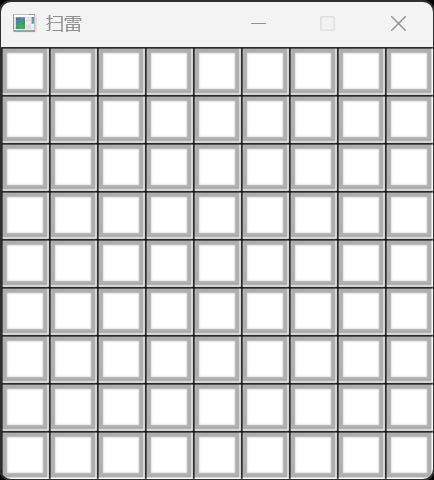
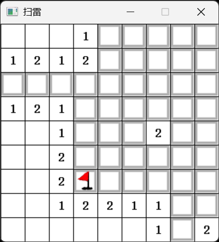
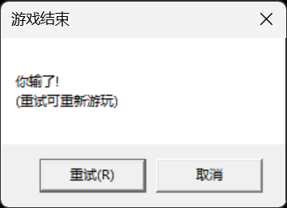
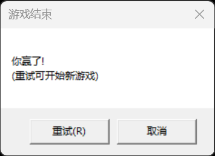

# Minesweeper-ACL
A minesweeper game based on the ACL library. 

-   一个简单的扫雷游戏，使用ACL库实现，支持左键揭示格子，右键标记地雷，N键开始新游戏，R键重新开始游戏。
-   有10个地雷，9x9的格子，每个格子有可能是地雷，也有可能是安全格子，揭示安全格子时会显示周围的地雷数。
-   揭示到地雷时游戏结束，揭示所有非地雷格子时游戏胜利。
-   通过随机生成地雷位置，预计算每个格子周围的地雷数，实现了简单的扫雷逻辑。
-   通过ACL库的绘图功能，实现了简单的界面显示。
  
游戏截图：  
  
  
  
  
